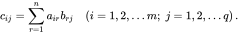
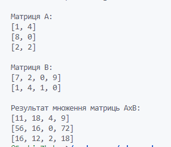
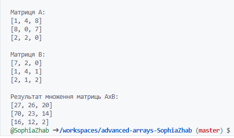

# Практична робота "Поглиблене використання масивів"

## Суть завдання

1. написати клас, який містить методи для розв'язання обраного вами завдання та тестовий клас, який дозволяє перевірити його роботу. Класи мають міститись у теці ```src```. Не забуваємо про те, що основний клас **має бути універсальним, тобто він не містить інтерфейсу користувача - лише логіку (статичний метод), яка диктується завданням** (і можливо не всі його методи мають бути публічними)!
2. методу ```main``` тестового класу **не може містити ніякої логіки, пов'язаної з виконанням завдання** - лише перевіряти працездатність основного класу!
3. **README.MD репозиторію має містити опис обраного вами завдання** (краще - з картинками та форматуванням :blush:)!
4. **УВАГА!** Не слід вважати, що завдання дуже прості! Вам необхідно подбати про:
    * **оптимізацію програми - обрати оптимальні з точки зору обсягу використовуваної пам'яті типи даних**
    * **іменування змінних і констант у відповідності до рекомендацій**
    * **javadoc-коментарі для основного класу, які пояснюють що саме обчислюється і які вихідні дані для цього потрібні**

## Обране завдання

6. Знайти [добуток](https://uk.wikipedia.org/wiki/%D0%9C%D0%BD%D0%BE%D0%B6%D0%B5%D0%BD%D0%BD%D1%8F_%D0%BC%D0%B0%D1%82%D1%80%D0%B8%D1%86%D1%8C) двох матриць розмірами N x M та  M x Q

Добуток двух матриць обчислюється за формулою:



### Код, що містить TestResult.java
```java
import java.util.Arrays;

/**
 * Основний клас, що представляє головну точку входу програми для множення
 * матриць. Він генерує матриці випадкового розміру та заповнює їх випадковими
 * числами, потім виводить результат.
 *
 * @author Софія Жаботинська
 */
public class TestResult {

    public static void main(String[] args) {

        // Встановлення розміру матриці A

        // Заповнення та вивід матриці A
        int[][] matrix_A = {{1, 4}, {8, 0}, {2, 2}};
        System.out.println("\nМатриця A:");
        printMatrix(matrix_A);

        // Заповнення та вивід матриці B
        int[][] matrix_B = {{7, 2, 0, 9}, {1, 4, 1, 0}};
        System.out.println("\nМатриця B:");
        printMatrix(matrix_B);

        // Заповнення(клас Calculate реалізує цей метод) та вивід матриці AxB
        int[][] matrix_AxB = new int[matrix_A.length][matrix_B[0].length];
        matrix_AxB = Calculate.multiplicateMatrixs(matrix_A, matrix_B, matrix_AxB);
        System.out.println("\nРезультат множення матриць AxB:");
        printMatrix(matrix_AxB);

    }

    /**
     * Виводить матрицю на консоль.
     *
     * @param matrix матриця для виведення
     */
    public static void printMatrix(int[][] matrix) {
        for (int[] row : matrix) {
            System.out.println(Arrays.toString(row));
        }

    }
}
```

### Код, що містить Calculate.java

```java
/**
 * Клас, що містить методи для виконання множення матриць.
 *
 * @author Софія Жаботинська
 */
public class Calculate {
     /**
     * Перемножує дві матриці `matrix_A` та `matrix_B` та зберігає результат у `matrix_C`.
     * Розміри матриць повинні бути сумісними для множення:
     * кількість стовпців `matrix_A` повинна дорівнювати кількості рядків `matrix_B`.
     *
     * @param matrix_A перша матриця
     * @param matrix_B друга матриця
     * @param matrix_C матриця для зберігання результату множення
     * @return матриця `matrix_C` з результатом множення `matrix_A` та `matrix_B`
     * @throws IllegalArgumentException якщо розміри матриць не сумісні для множення
     */
    public static int[][] multiplicateMatrixs(int[][] matrix_A, int[][] matrix_B, int[][] matrix_AxB) {
        
        if ( matrix_A[0].length != matrix_B.length) {
            throw new IllegalArgumentException("The dimensions of the matrices are not compatible for multiplication");
        }
        
        for (int i = 0; i < matrix_A.length; i++) {
            for (int j = 0; j < matrix_B[0].length; j++) {
                for (int k = 0; k < matrix_A[0].length; k++) {
                    matrix_AxB[i][j] += matrix_A[i][k] * matrix_B[k][j];
                }
            }
        }
        return matrix_AxB;
    }

}
```

## Скріншоти роботи програми

Множення матриць 3x2 та 2x4



Множення двух матриць 3x3

